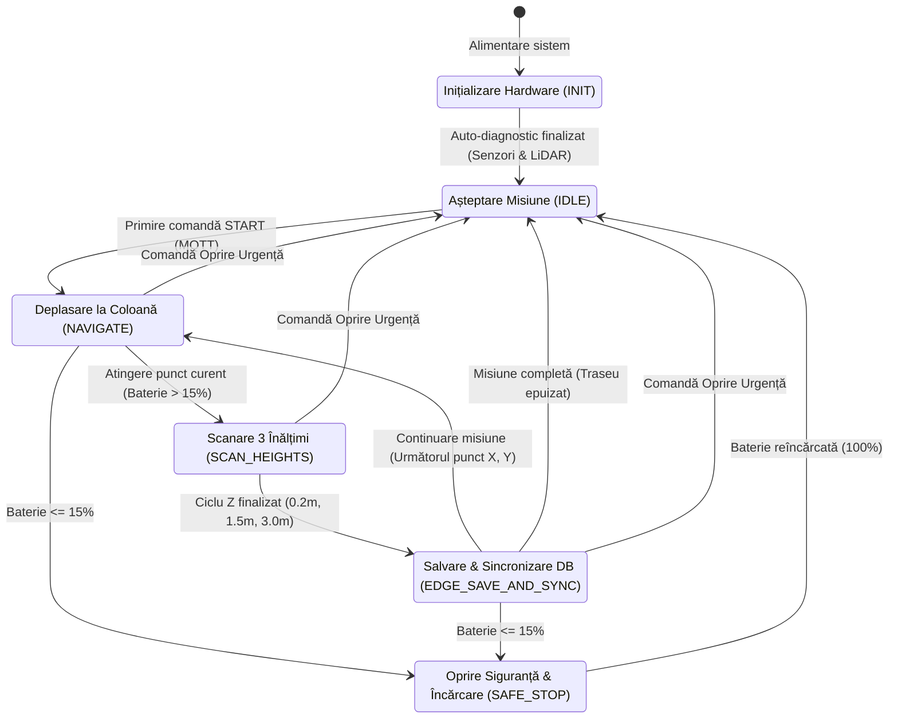

# DAFI-project
Sistem Cyber-Fizic pentru Monitorizare AMR Pharma

# README – Proiect DAFI: AMR Pharma (Sistem Cyber-Fizic GxP)

**Disciplina:** Dezvoltarea Arhitecturilor de Fabricare Inteligente (DAFI)  
**Instituție:** Universitatea POLITEHNICA București – FIIR  
**Student:** Ana-Maria MIU (Master AIII)  
**Data:** Mai 2026  

## Descrierea Proiectului
  Acest proiect reprezintă prototipul software pentru un **Sistem Ciber-Fizic (CPS)** de nivel industrial. Se simulează un robot autonom (AMR) dotat cu un senzor pe un braț telescopic, care se deplasează printre rafturile unui depozit farmaceutic (High-Bay) pentru a verifica dacă medicamentele sunt păstrate în condiții optime (sub 25°C), mapând datele obținute într-un format 3D.
  
  Sistemul este structurat în două module decuplate care comunică prin protocolul MQTT:
  1. **Creierul Robotului (`engine.py`):** Rulează fizic pe robot (Edge). Gestionează hardware-ul, scanează temperatura la 3 înălțimi diferite, monitorizează autonomia bateriei și înregistrează automat fiecare eveniment într-un registru intern imuabil (baza de date SQLite).
  2. **Interfața Web / Digital Twin (`app.py`):** Rulează pe stația de lucru a operatorului. Oferă o hartă termică volumetrică 3D în timp real, un panou de comandă și funcții pentru generarea rapoartelor de audit.


## Controlul Accesului (RBAC - Role-Based Access Control)
Sistemul implementează politici de securitate stricte. În funcție de rolul alocat, utilizatorii dispun de permisiuni diferite pentru a garanta separarea responsabilităților (Segregation of Duties):

| Utilizator | Parolă | Rol și Nivel de Acces |
| :--- | :--- | :--- |
| **`manager`** | `dafi2026` | **Control Operațional (Read & Write):** Permite inițierea misiunii (START), setarea dimensiunilor halei și oprirea de urgență a sistemului. |
| **`auditor`** | `pharma123` | **Inspector Calitate (Read-Only):** Acces limitat la vizualizarea hărții și la descărcarea rapoartelor de deviații GxP (.XLSX) și tehnice (.CSV). Comenzile către robot sunt blocate. |

## 1. Maparea Nevoilor Industriale (Soluție CPS)

| *Nevoie industrială concretă* | *Soluția CPS implementată* | *Modul software responsabil* |
|:---|:---|:---|
| **Monitorizarea zonelor oarbe în rafturi High-Bay** | Deplasare pe axele X, Y și scanare secvențială la 3 înălțimi (Z) via braț telescopic. | Starea `SCAN_HEIGHTS` din `engine.py` |
| **Menținerea integrității medicamentelor (GDP)** | Detectarea excursiilor termice (> 25°C) în timp real și modelarea lor în Harta 3D. | HMI Dashboard (`app.py`) |
| **Garantarea datelor pentru auditul farmaceutic** | Jurnalizare digitală securizată ALCOA+ în SQLite a *fiecărei stări FSM*, rezistentă la pierderea conexiunii Wi-Fi. | Continuous Edge Logging (`engine.py`) |

## 2. Diagrama Automatul de Stări (State Machine)

  Funcționarea robotului este divizată în pași discreți și deterministici. O inovație față de simulările teoretice o reprezintă starea de `INIT`, care modelează calibrarea hardware fizică anterior acceptării comenzilor.

### Reprezentare Vizuală (Sintaxă Mermaid)



## 3. Justificarea Arhitecturii (Standarde Industriale)
  * **Tranziția Hardware (INIT → IDLE):** Echipamentele fizice necesită o fază de calibrare. Starea `INIT` impune o întârziere pentru inițializarea senzorilor și citirea tensiunii bateriei (BMS), prevenind pornirile necontrolate.
  * **Eficientizare Hardware:** Achiziția de date (`SCAN_HEIGHTS`) este decuplată de deplasare. Robotul este programat să staționeze la fiecare coloană înainte de extinderea senzorului, atenuând vibrațiile mecanice ce pot compromite citirea profilului termic.
  * **Integritatea Datelor (ALCOA+):** Trecerea în stadiul de salvare (`EDGE_SAVE_AND_SYNC`) se efectuează exclusiv după generarea pachetului complet aferent celor 3 cote, prevenind stocarea profilelor incomplete.
  * **Siguranță (Fault-Tolerance):** Scăderea bateriei sub 15% declanșează starea prioritară `SAFE_STOP`. Misiunea este întreruptă controlat, permițând retragerea automată la stația de încărcare.

## Factori din Realitatea Fizică (Constrângeri Hardware)
  Sistemul răspunde la limitări operaționale întâlnite în mediile logistice reale:
  * **Dinamica Brațului Telescopic:** Ridicarea fizică a senzorului presupune inerție. Starea `SCAN_HEIGHTS` a fost proiectată să aloce "timpi de stabilizare", prevenind înregistrarea curenților de aer generați de mișcare ca fiind fluctuații termice ambientale.
  * **Atenuarea Semnalului (Efectul Faraday):** Structurile metalice High-Bay degradează conexiunile Wi-Fi. Pentru a asigura trasabilitatea neîntreruptă a datelor pentru audit, arhitectura include logare locală (Edge Computing), baza de date SQLite operând independent de conexiunea la rețea.

## Instrucțiuni de Utilizare și Rulare
  Execuția corectă a sistemului impune pornirea secvențială a microserviciilor, utilizând **două terminale separate**.

### Etapa 0: Pregătirea mediului
  Este necesară instalarea prealabilă a mediului Python și a dependențelor, prin rularea următoarei comenzi în terminal:
  ```
  pip install dash pandas plotly paho-mqtt
  ```

### Etapa 1: Lansarea Sistemului de Control (Edge FSM)
  Se deschide un prim terminal în directorul proiectului și se lansează procesul de bază:
  ```
  python engine.py
  ```
*(Se așteaptă execuția auto-diagnosticului `INIT` până la afișarea tranziției în starea `IDLE`. Acest terminal trebuie păstrat activ în fundal pe durata întregii sesiuni).*

### Etapa 2: Lansarea Interfeței de Monitorizare (Digital Twin)
  Se deschide un **al doilea terminal** (distinct de primul) și se execută:
  ```
  python app.py
  ```

### Etapa 3: Operarea Platformei
  1. Navigarea se realizează prin deschiderea unui browser web la adresa: `http://127.0.0.1:8050`
  2. Pentru operare completă, autentificarea se efectuează folosind contul: `manager` (Parolă: `dafi2026`) sau `audit` (Parola: `pharma123`).
  3. Se definesc dimensiunile geometrice ale halei și se inițiază procesul apăsând **START MISSION**. Populația hărții termice 3D se va realiza în timp real, sincronizat cu parcursul robotului.

## Checklist Final P3 
  x Tabelul Nevoie → Soluție → Modul: Este detaliat în Secțiunea 1, corelând precis provocările logistice reale (zone oarbe High-Bay, standarde GDP, audit GxP) cu modulele software dezvoltate (engine.py și app.py).
  x Diagrama State Machine (Logică, Achiziție, Baterie): Structura Mermaid din Secțiunea 2 ilustrează clar ciclul de viață determinist al robotului, incluzând tranzițiile critice declanșate de pragul de siguranță al acumulatorului (<= 15%).
  [x] Sistemul de întreruperi manuale: Diagrama FSM include vizual liniile de tranziție rapidă de la stările operaționale (Maps, SCAN_HEIGHTS, EDGE_SAVE_AND_SYNC) direct către starea IDLE la comanda de Emergency STOP.
  [x] Legenda și justificarea tehnică (Industria Farmaceutică): Secțiunea 3 și blocul dedicat limitărilor hardware fundamentează deciziile de arhitectură utilizând principii specifice domeniului (ALCOA+, timp de stabilizare a senzorilor, imunitate la zonele moarte Wi-Fi).
